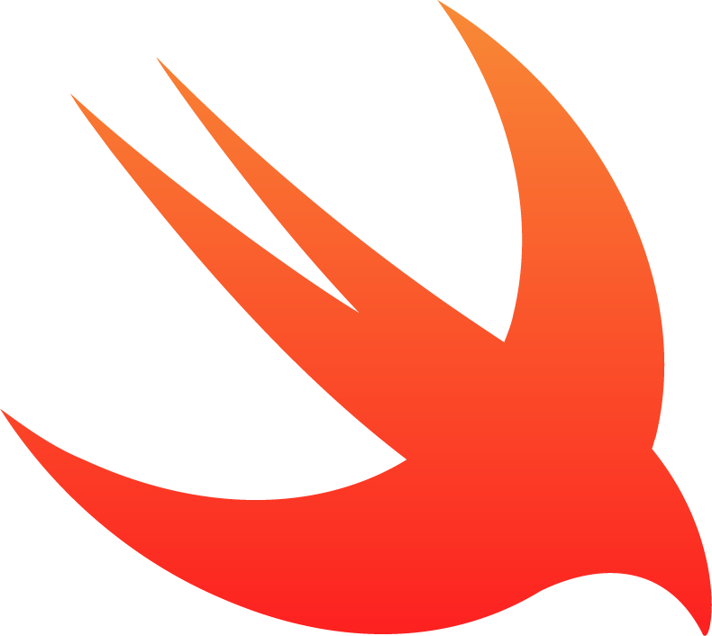

<h1>JGeek00</h1>
<b>Welcome to my personal repository!</b>

<h3>About me</h3>

  I am a technology enthusiast and frontend developer (mobile and web). I enjoy learning and discovering new things about this world. In my free time I like to research new features and develop applications for everyone. Some of that applications are available on the Google Play Store and on the App Store.

<h3>Technologies</h3>

Here's a list of the technologies that I use.

<h4>Frameworks/libraries</h4>

<table>
  <tr>
    <td>
      

    </td>
    <td>
      

    </td>
    <td>
      

    </td>
  </tr>
  <tr>
    <td>
      
<b>Flutter</b>

    </td>
    <td>
     
<b>SwiftUI</b>

    </td>
    <td>
      
<b>React.js</b>

    </td>
  </tr>
</table>

<h4>Languages</h4>

<table>
  <tr>
    <td>
      

    </td>
    <td>
      

    </td>
    <td>
      

    </td>
    <td>
      

    </td>
  </tr>
  <tr>
    <td>
      <b>
Dart
</b>
    </td>
    <td>
      <b>
JavaScript
</b>
    </td>
    <td>
      <b>
TypeScript
</b>
    </td>
    <td>
      <b>
Swift
</b>
    </td>
  </tr>
</table>